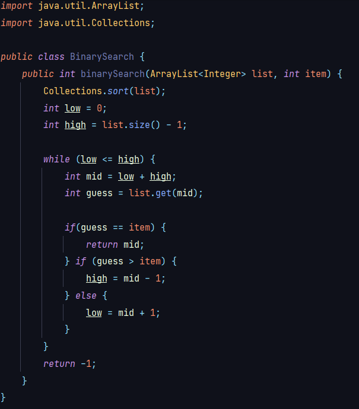
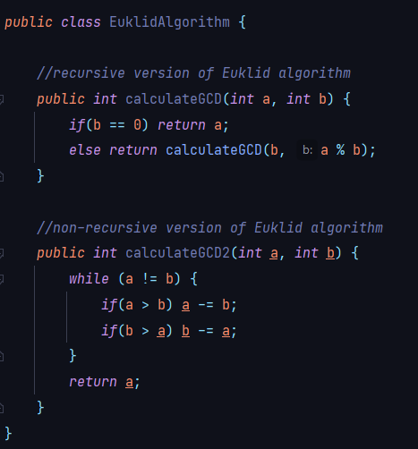

# Useful-Algorithms
All images and code block formatted with [Carbon](https://carbon.now.sh)
Repository containing some of the most popular and useful algorithms.

- [Binary search](#binary-search)
- [Euklid algorithm](#euklid-algorithm)

## Binary search
Aditya Y.Bhargava, *Grokking Algorithms: An illustrated quide for programmers and other curious people*

## Euklid algorithm

